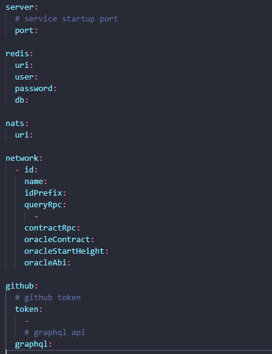
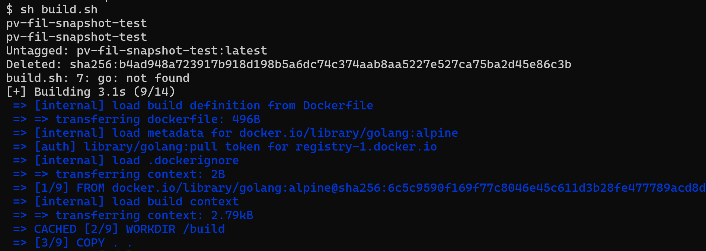
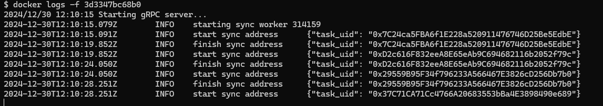

# PowerVoting Snapshot Compilation Guide

#### 1. Install Go Toolchain

First, ensure you have the Go toolchain installed. You can find installation instructions [here](https://go.dev/doc/install). Make sure you have Go version >= 1.20.

#### 2. Install Docker

Install Docker by following the instructions for your operating system [here](https://docs.docker.com/engine/install/).

#### 3. Install Redis Server

Install the Redis server Docker image by running the following command:

```
docker pull redis
```

#### 4. Clone the PowerVoting Snapshot Repository

Clone the PowerVoting backend repository with the repository branch set to `main`:

```
git clone https://github.com/filecoin-project/on-chain-voting.git
```

#### 5. Modify the Configuration File

Edit the `configuration.yaml` file as needed for your environment.



#### 6. Build the Project

Run the shell script to build project:

```
sh build.sh
```



#### 7. View Logs

To monitor the logs of the running container, you can use the Docker logs command:

```
docker logs <container_id>
```



By following these steps, you will successfully compile, build, and run the PowerVoting backend using Docker.
